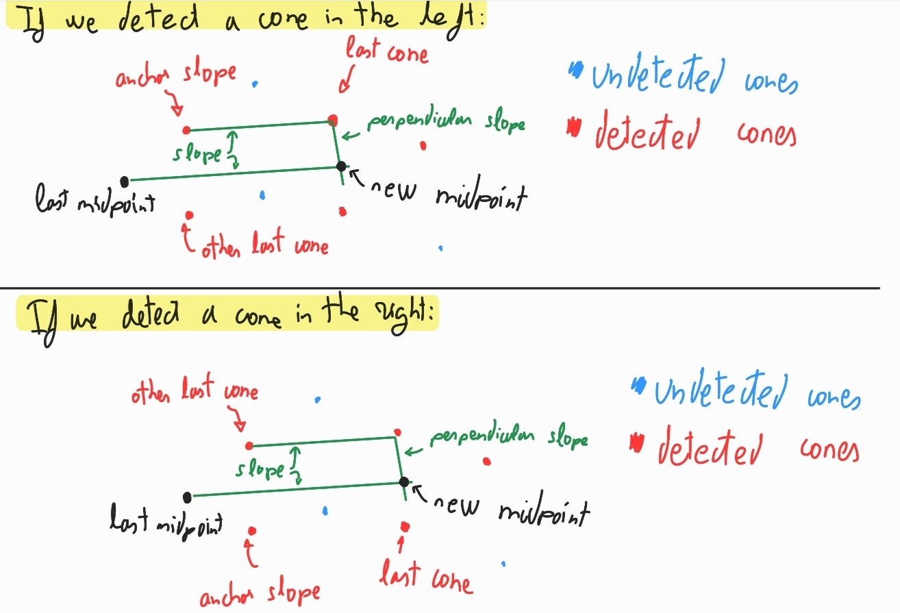
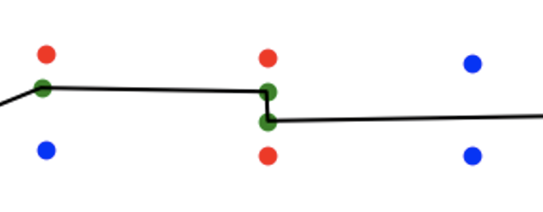

# Structure of the repo

- `final_pub.py`: the important function is `run_pub`, which publishes random points from a randomly generated trajectory at random times.
- `final_sub.py`: the important function is `run_sub`, which retrieves the points from the topic and computes the trajectory using the algorithm implemented in `compute_trajectory`.
- `plotter.py`: both pub and sub save logs in the logs folder. Then, after running the simulation, the `plotter` function will plot them matching the timestamps to recreate the simulation as if running in that moment.
- `utility_funcs.py`: this file contains functions for: manipulating points, vectors, line functions, serializing lists of points into log files, deserializing log files into lists of points, ordering lists, etc.
- `main.py`: I am not sure why this way does not work, neither with multiprocessing or multithreading. But when I open 2 console tabs and run the python commands, then they work. I have read that sockets are not thread-safe so multithreading won't work. But for multiprocess maybe each process has its own socket copy or something? Not sure though.

Now I will explain the implementation of each file in detail, highlighting the logic and the reasons behind that specific implementation.

# final_pub.py

- `gen_straight_line`: Generates a straight line segment of random length (between 20 and 80 meters) with a given initial position, direction, and width. It returns the final position, final direction, and lists of the generated right and left cone points along the line.
    - Algorithm: 
        1. Use the perpendicular vector of the direction, with legth width/2 to get the first cones at each side of the initial position.

        2. We differentiate vertical and non-vertical lines. We do a random partition where each cone should be from 3 to 5 meters apart (in the x axis, not total distance between cones, just to keep it simpler)

                WARNING: Check the reverse is still necessary because I think it is not.

            2.1. The differentiation between vertical and non-vertical is because the slope would be inf. 

- `gen_turn`: Generates a turn segment with a random degree (45, 90, 135, or 180) and orientation (left or right) and radius from 9 to 25 meters. It takes the initial position, direction, and width as input. It returns the final position, final direction, and lists of the generated right and left cone points along the turn.
    - Algorithm:
        1. Get the final direction by rotating the initial direction the degrees of the curve.

        2. Get the final position by using that the radius is perpendicular to the direction in both initial and final points. So you have both
        radius vectors, you can go from the initial position to the centre and from the centre to the final position.

            2.1 Notice that the rotation to get the radius-vector depends on whether we are turning left or right.
        3. Using the length of the arc and separate the points between 1 and 4 meters. 

            3.1 Using that arc-length separation we can compute the separation in degrees.

            3.2 compute the points, the inner circle would have radius - width/2 and the outer circle would have radius + width/2.

            3.3 Notice that whether the inner circle correspond to right or left cones depends on whether we are turning right or left.

        4. Having the angles, we can start rotating the radius-vector and multiplying it by the radius of inner and outer points.

- `remove_some_cones`: Randomly removes some cones from the input lists of right and left cones, keeping the first cone and using a maximum skip size to control how many adjacent cones can be removed. The idea of skip size is to don't randomly remove 1 point 7 times in a row therefore removing 7 consecutive cones. That way it might or might not remove and always skipping the amount of cones we specify, no more and no less.

- `disorder_points`: Shuffles the order of points in two input lists randomly. Just random.shuffle of 2 lists. This is not very realistic because then the car might see a cone 50 meters away but not just in front a couple of meters awy.

- `permute_pairs`: Randomly permutes pairs of points within two input lists. Here is a more realistic case where we only detect in the wrong order a cone and the following one but not see first one that is really far.

- `perception_sender`: Sends cone points to the simulator via a ZMQ socket. It randomly selects a right or left cone point and sends it with a topic indicating its type (0 for right, 1 for left). It introduces a random delay between messages. We will do this for every segment (straight line or turn) generated. Since we might run out of (for example) right cones of a segment before finishing sending the left cones, if fortune decides to send another right cone that we don't have, then it will send an empty message instead. This is properly handled in the receiver.

- `run_pub`: Main function that sets up the ZMQ publisher socket, generates a random track (straight lines or turns), and sends the generated cone points to the simulator. This is done iteratively in an infinite loop.
    - Algorithm: 
        1. We have a starting orange box (that is plotted when using plotter but not stored in the logs) 5 meters wide so that is the initial width for the first patch.
            1.1 At each iteration the width is randomly changed by 0.5 meters. But never get outside the range of [3,6]
        2. Then we randomly choose a patch (straight or turn) and reset the new initial position and direction as the final position and direction of the new patch. 
        3. We remove the first cone of each list because that way we don't get duplicated cones with the next patch (we could also remove the last cones instead, it is the same)
        4. Serialize all the generated cones as ogpoints (original points)
        5. We remove some cones to simulate imperfect detection
        6. We also disorder the cones. Here we could either choose to use the permute pairs or complete disorder.
        7. Finally the perception sender starts the random sending until it runs out of points and a new iteration starts with a new patch.

# final_sub.py

- `order_point_list`: Orders a list of points based on their proximity (euclidean norm) to the last ordered point. It takes a list of points and a starting point as input and returns a new list with the points ordered.
    - This function assumes that the first point in the ordering is known.

- `order_both_lists_of_cones`: Orders two lists of points (right and left cones) using the previous function. It takes a reference point (which could be the position of the car) and gets the cone that is the closest to that point as the first point for the ordering in the previous function.

- `compute_trajectory`: Computes the car's trajectory based on the ordered lists of right and left cones. It takes the two lists and a starting point as input and returns a list of trajectory points.
    - Args:
        - `rpoints` (list): Ordered list of right cone coordinates.
        - `lpoints` (list): Ordered list of left cone coordinates.
        - `start_point` (list): Initial point of the trajectory.
    - Returns:
        - `mid_points` (list): List of trajectory points.
    - Algorithm:
        1. Initialize the trajectory with the `start_point` which represents the begining point when entering a patch. This would then represent the position of the car because we can safely say the car won't find new cones behind it.
        2. Now let's dive into the **algorithm for computing the trajectory**:
            - The idea is that we don't know how many cones or from which side are going to have, so the plan is to make the algorithm use as few cones as possible. For this, I am assuming the 2 first orange cones (called last cones) are detected and 1 cone from any side of the track is detected.
                - Once a cone is already used for computing a midpoint, it will become the new last cone of that side, replacing the previous one.
                - Notice that every single cone will be used to compute a midpoint for the trajectory (except for the first 2 cones that we assume we are already in the middle if we are starting the first lap or we already used it for computing a midpoint if they were new detected cones in a previous call of this function)
                - Notice also that we always have at least one midpoint, which is the initial position of the car when starting the computation.
                
            - For getting a new point from those 2 last cones and the new detected cone which can be in any side, we will do the intersection of 2 perpendicular lines:
                - The line passing through the last midpoint is parallel to the line defined by the `anchor_slope` cone (previous last cone in the side that detected a new cone) and the `last_cone` (newly detected last cone in that side).
                - The perpendicular line will pass through that `last_cone`
                - The intersection of these 2 lines is the new midpoint.
                - The `other_last_cone` is the last cone in the other side that is not used for computing the new midpoint. This is just to keep track of that cone in that side and to (as we will see in the next section of the algorithm) choose whether we will use the next right cone or next left cone as our `last_cone`. So in reality, we only use the `last_cone`, `anchor_slope` and last midpoint to define 2 lines and intersect them to get the new midpoint.
                - Here is a picture of what is happening here:
                
                - When we say "detected" we don't really mean that the cones are  really being detected in that precise moment, since we ordered the cones in the same way the car will physically encounter them on each side, then it is like if we detected a new point as we advance in the iteration. But due to that reordering based on distances, it does not have to match the real detection order. Also the detection is running asynchronously, there are no really new points entering this loop until we finish both lists of already detected cones.

        3. **Fixing this initial algorithm**:
            The idea is simple enough and should work but it has some flaws:

            3.1 **From which side do we choose the new last cone when we still have points remaining in both lists**

            - The solution I applied here is to choose the cone that is the closest to the previous last cones. So for the next cone coming in each side, we compute the euclidean distance to both last cones and sum them. Then compare them and take the shortest as the next cone.
            
                - This solution may lead to some problems when we have like a cone very far away in one side and the cones in the other side are closer than the track width. In that case the cone choosing might mess it up.
                
                - After choosing the next ´last_cone´ we can assign the ´anchor_slope´ to the previous last cone of that side and assign to ´other_last_cone´ the last cone of the other side, as shown in the picture before.
            
            3.2 **What happens if the intersection of lines (for computing the new midpoint) ends up too close to a cone and then the car (as it is not a point) might start hitting the cones?**
            - For this, we will hardcoded set the distance from the new midpoint to the `last_cone` used to compute it, to 1.5m. This arbitrary number was chosen so that in case the track width is minimum (3m) we would be in the middle of the track. It could be changed and with more information it could be adapted to an approximated track width so that the car stays in the middle even when the track width is more than 3m.

            - The line defined by the last midpoint and the last cone doesn't change. Only the relative distance changes.
            
            3.3 **Sometimes the intersection of lines ends up outside the track!! What can we do?**
            - In the testing this happened when too many points were missed and there was a steep curve. To solve this issue we apply the following heuristic:
                - Let's say we are in midpoint $n$ and want to go to midpoint $n+1$ which was computed using `last_cone`. So looking from midpoint $n$ we would expect that if last cone is a right one, midpoint $n+1$ is *to the left* of `last_cone`. And viceversa, if the ´last_cone is a left one, then we want midpoint $n+1$ *to the right*. 
            - How is that to the right (or clockwise) and the left (or counterclockwise) implemented? Using the vector product of the vectors that start in midpoint $n$ and go to midpoint $n+1$ and `last_cone`.
            - If we find the new midpoint to be in the wrong side, we just rotate it 180º with respect to the `last_cone`.

            3.4 **Since we are computing one midpoint for each cone, for a pair of cones that should define only one midpoint, we get 2 midpoints!**
                

            - In this case, what I would do is another pass that merges too close points. The definition of "too close" is quite arbitrary to be honest. It is not a beautiful solution, but seems to work well if the parameter is chosen correctly (which is complicated with varying widths of the track).
                - Merge here would be taking the point in between.
            - This step is now applied outside of the compute_trajectory function because it is convenient to keep track of all the computed midpoints in order to match the indices for the right and left detected points.

- `merge_too_close_points`: Merges points in a list that are closer than a given distance tolerance. This is that last step of the algorithm. It takes the list of points and a distance tolerance as input and returns a new list with close points merged. Right now it does 2 passes so that it might merge up to 4 points if they are really close. The tolerance for the second pass is half the tolerance for the first pass. It only merges 2 consecutive points in each pass, no more.

- `run_sub`: Main function that sets up the ZMQ subscriber socket, receives cone points from the publisher, and computes the trajectory. It uses a poller to efficiently handle incoming messages and performs calculations after processing all available messages.
    - Algorithm:
        1. Initialize lists to store right and left cone points, as well as the trajectory midpoints.
        2. Set up the ZMQ subscriber socket and connect to the publisher.
        3. Subscribe to the right and left cone topics.
        4. Use a poller to wait for incoming messages. This helps retrieving all the messages if during the trajectory computation, more than one message was published.
        5. When non-empty messages arrive just ignore them and add the received cone points to the corresponding lists.
        6. After processing all available messages, perform calculations:

            a. Trim the lists of cone points to a specified limit, keeping only the most recent points on each side.

            b. Keeps track of the number of cones that are removed from each list (accumulated), which means that we won't detect new cones in that part of the track any more (up to `lim` cones per side).
            
            - Removes the min of those indices from midpoints. This is a conservative remove because we don't know which midpoints were computed using the left or right cones. So we remove just the safe minimum. 
            - The last point that is a final midpoint is the reference point (or start point) for ´compute_trajectory´.
            - This trim is the reason why we don't do the merge of midpoints inside `compute_trajectory`.

                    Warning: this way of removing cones and midpoints without knowing which midpoints were associated with which cones leads to potentially removing cones of midpoints that are still being computed and this is why we see trajectory changes in the playback that are not associated with new cones. Figuring out a way to remove at the same time the pairs of midpoints and cones, would probably fix the issue. 

            c. Order both lists of cones after receiving new cones and pass them to the `compute_trajectory`.

            d. Merge close trajectory points using `merge_too_close_points`.

            e. Serialize the seen cone points and the computed trajectory midpoints to log files.

# plotter.py

This script plots the trajectory and seen cones.  The `plotter()` function handles both live plotting and video generation. For live plotting, call `plotter()` with default arguments. For video generation, call `plotter(video=True)`. This saves a video to `output.mp4`.

The script was intended to run in multithreading but since I did not manage to do it with pub and sub, I made it to work with just the logs.

# utility_funcs.py

In order to make it simpler to change to C++, the idea was to don't use any fancy library that might not be in C++ unless it was strictly necessary. So here are the geometric manipulations and some functions that are not that important but are used in the implementation.

// Notice that these function are not very polished and there are duplications. For example, it is the same to call the `rotate_180` or the `rotate_vector` with degrees=180. So it can be hugely improved.

## Line Functions

- `compute_slope(p1, p2)`: Computes the slope of the line defined by two points p1 and p2. Returns float('inf') if the line is vertical.
- `get_line_function(slope, point)`: Returns a callable line function given its slope and a point on the line (or an x value if it is a vertical line)
- `find_intersection(slope1, point1, slope2, point2)`: Finds the intersection point of two lines defined by their slopes and a point on each line. Returns None if the lines are parallel.

## Vector manipulation functions

- `compute_vector(p_i, p_f)`: Computes the vector from an initial point to a final point.
- `normalize_vector(vector)`: Normalizes a vector using the Euclidean norm. Returns the same vector but with norm 1.
- `scalar_mul(vect, scalar)`: Multiplies a vector by a scalar.
- `add(vect1, vect2)`: Adds two vectors.
- `get_perpendicular_vector(vector)`: Given a vector, returns the perpendicular vector.
- `rotate_180(vector)`: Rotates a vector 180 degrees.
- `rotate_vector(vector, degrees)`: Rotates a 2D vector by a specified angle in degrees counterclockwise.
- `is_clockwise(vector1, vector2)`: Determine if the rotation from vector1 to vector2 is clockwise or counter-clockwise using the sign of the cross product

## Point Manipulation Functions

- `compute_midpoint(p1, p2)`: Computes the midpoint of the line segment defined by two points p1 and p2.
- `euclidean_norm(p1, p2)`: Computes the Euclidean distance between two points p1 and p2.

## Angle and Arc Functions

- `arc_to_angle(arc_length, radius)`: Calculates the angle increment in degrees for a given arc length and radius.
- `angle_to_arc(angle_degrees, radius)`: Calculates the arc length in meters for a given angle and radius.

## Other utility functions (no geometry here)
- `random_partition(start, end, min_distance, max_distance)`: Generates a list of points between a start and end value, with random spacing within the specified min and max distances.

- `first_different_index(list1, list2)`: Compares two lists and returns the index of the first element that differs between them.

## Serialization Functions

- `serialize_points(right_points, left_points, filename, logs_folder)`: Serializes two lists of cones, right and left cones, to a file.
- `deserialize_points(file_path)`: Deserializes two lists of cones, right and left cones, from a file.
- `serialize_midpoints(midpoints, filename)`: Serializes a list of midpoints to a file.
- `deserialize_midpoints(filename)`: Deserializes a list of midpoints from a file.

# How to run this:

For the pub sub stuff, run first the sub and then the pub scripts in different shells. Once finished (using the keyboard interruption Ctrl+C) run the plotter to see what happened.